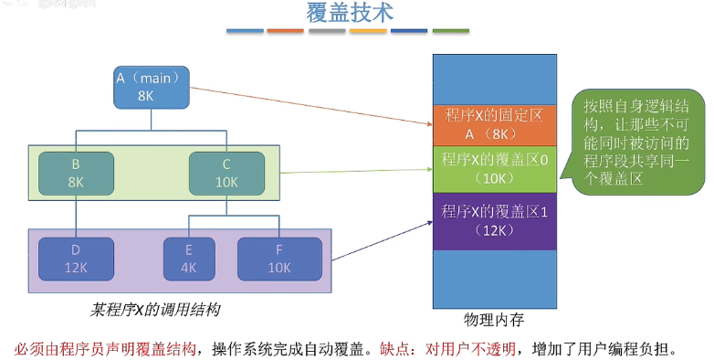

## 内存基础
- 按字节编程、按字编程
- 逻辑地址，物理地址
- 源代码到运行的过程：
	1. 编译
	2. 链接
	
	   - 静态链接，打包为一个完整程序
	   - 装入时动态链接，装入时进行链接
	   - 运行时动态链接，调用到时进行链接（便于共享）
	3. 装入内存
	
	   - 绝对装入（**单道程序** 编译时确定地址，装入内存指定区域）
	
	   - 静态重定位（**多道批处理** 装入程序确定地址，装入后不改变地址）
	
	   - 动态重定位（**重定位寄存器** 允许程序在内存中发生移动）

## 内存管理基础

操作系统应该实现的内存管理功能：
- 内存空间的分配与回收
  - [连续分配管理方式](#连续分配管理方式)
    - 单一连续分配
    - 固定分区分配
    - 动态分区分配
  - 非连续分配管理方式
    - [基本分页存储管理](#基本分页存储管理)
    - [基本分段存储管理](#基本分段存储管理)
    - [段页式管理方式](#段页式管理方式)
- 内存空间的扩充
  - 虚拟技术（虚拟内存）
- 地址转换
- 内存保护（进程间互不干扰）
  - 进程上下限寄存器（都是物理地址）
  - 基址寄存器（物理地址）、界地址寄存器（逻辑地址）

## 内存空间扩充技术
- 覆盖技术（程序内部区分）
	- 将程序分为多个段，内存中分为“固定区”存储常用程序、“覆盖区”存储可选模块
	- 事先声明调用结构（增加编程负担）
	- 
- 交换技术（多个程序之间区分）
  - 将内存中某些进程暂时换到外存（中级调度）
  - 挂起状态（七状态模型），就绪挂起/阻塞挂起
  - 磁盘分为文件区、对换区（连续分配）
  - 内存与磁盘对换区部分进行交换
  - 经常出现缺页时进行交换，缺页率降低后停止
  - PCB常驻内存，不会换出

- 虚拟存储技术

## 连续分配管理方式

内存分为系统区、用户区

- 内部碎片：进程没用上分配的内存

- 外部碎片：内存空闲分区太碎，难以被利用

单一连续分配（单道程序）

- 可以采用覆盖技术
- 只适用于单用户单任务
- 无外部碎片，内部碎片多

固定分区分配

- 将用户空间固定划分为多个分区
- 建立分区说明表
- 无外部碎片，内部碎片多

动态分区分配

- 数据结构

  - 空闲分区表
  - 空闲分区链

- 动态分区分配算法（*首次适应算法）

  | 算法         | 英文      | 实现                                                   | 缺点                                 |
  | ------------ | --------- | ------------------------------------------------------ | ------------------------------------ |
  | 首次适应算法 | First fit | 地址递增排列，找地址最前面的                           | 低地址部分出现很多小分区，查找慢     |
  | 最佳适应算法 | Best fit  | 大小递增排列，找最小的                                 | 容易产生小的外部碎片；需要排序       |
  | 最坏适应算法 | Worst fit | 大小递减排列，找最大的                                 | 大分区被使用，大进程难分配；需要排序 |
  | 邻近适应算法 | Next fit  | 地址递增排列成环，每次都从上一次查找结束的位置开始查找 | 高地址大分区容易被用，大进程难分配   |

- 有外部碎片，无内部碎片

## 基本分页存储管理

> 连续空间可能产生“紧凑”操作，时间消耗很高->非连续分配管理

将内存分为[页框/页帧/内存块/物理块]

每个页框有一个[页框号/页帧号/内存块号/物理块号]

将进程分为[页/页面]，一一对应放入页框中

- 每个进程中连续存储一个页表<页号，块号>，其中页号隐含
- 地址转换：

- **基本地址变换机构**（硬件）
  - 进程控制块PCB中存放【页表起始地址、页表长度】
  - 系统中设置一个**页表寄存器（PTR）**，**当进程被调度时**存入【页表起始地址，页表长度】
  - 流程：
    1. 通常会在系统中设置一个页表寄存器，存放页表在内存中的起始地址和长度。
    2. 进程未执行时，页表的起始地址和长度会存放在PCB中，当进程被调度时，操作系统内核会把它们放到页表寄存器中。
    3. 进程发起读内存指令，系统获取逻辑地址
    4. 根据逻辑地址，计算出页号和页内偏移
    5. 利用页表寄存器，对页号的合法性进行检查，若页号>=页表长度，则抛出越界中断
    6. 页表[页号]-->页表项，确定页面存放的物理块号
    7. 物理块号、页内偏移-->物理地址
    8. 根据物理地址访存

- **快表（TLB）**（基本地址变换机构改进版本）

  > 局部性原理：时间局部性，空间局部性

  - 快表
    - 高速缓冲硬件，存放当前访问的页表项，以加快地址变换
    - 页表寄存器的部分副本<页号，内存块号> 
  - 流程
    4. 根据逻辑地址，计算出页号和页内偏移
    5. 到快表中遍历查找页号，若命中，直接获取到物理块号（无需访存）
    6. 若未命中，则到页表寄存器中查找物理块号，并将其放到快表中（需要访存）
    7. 物理块号、页内偏移-->物理地址
    8. 根据物理地址访存

| 机构                   | 访存次数                       |
| ---------------------- | ------------------------------ |
| 基本地址变换机构       | 两次访存                       |
| 具有快表的地址变换机构 | 快表命中：1次；快表未命中：2次 |

## 两级页表

> 单级页表：
>
> 1. 页表必须连续存放，需要占用很多连续页框
>
> 2. 没必要让进程整个页表常驻内存

顶层页表 [二级页表号] = 该页表的内存块号

二级页表 [页号] = 物理块号

逻辑地址组成：一级页号，二级页号，页内偏移

**步骤**：

	4. 根据逻辑地址，计算出一级页号，二级页号，页内偏移
	4. 在顶层页表中，根据一级页号获取到二级页表的内存块号，获取到二级页表（缺页中断）
	4. 缺页中断：将目标页面从外存读取到内存
	4. 在二级页表中，根据二级页号获取到页框的物理块号（越界中断）
	4. 根据物理块号、页内偏移计算出物理地址，进行访存

**多级页表**：

- 各级页表大小不能超过一个页面（页表长度不能超过页框大小），否则可以分更多级

- N级页表访问逻辑地址需要N+1次访存

## 基本分段存储管理

> 分页定长，分段不定长

分段：

- 进程按照自身逻辑分为多个段，每个段有一个段名、段号
- 内存分配以段为单位，段内连续，段间不相邻

逻辑地址组成：段号，段内地址

- 段号决定每个进程最多分为几个段
- 段内地址决定每个段最大长度为多少

段表：

- 系统维护段表寄存器，存放段基址、段长
- 每个段表项长度相同，连续存储

流程：

1. 通常会在系统中设置一个段表寄存器，存放段表在内存中的起始地址和长度。
2. 进程未执行时，段表起始地址和长度会存放在PCB中，当进程被调度时，操作系统内核会把它们放到段表寄存器中。
3. 进程发起读内存指令，系统获取逻辑地址
4. 根据逻辑地址，计算出段号和段内地址
5. 根据段表长度检查段号是否越界（段号不存在-->越界中断）
6. 获取到段表项（段表位置、段表长度）
7. **根据段长检查段内地址是否越界（越界中断）**
8. 获取到段基址
9. 计算物理地址

实现线程间共享：让各个进程的段表项指向同一个段（不应含有临界资源）

| 对比 | 分页                       | 分段                       |
| ---- | -------------------------- | -------------------------- |
| 空间 | 长度固定，页内地址不会越界 | 长度不固定，段内地址会越界 |
| 碎片 | 无外部碎片                 | 会产生外部碎片             |
| 管理 | 系统管理，用户不可见       | 编程决定，用户可见         |
| 地址 | 一维，连续                 | 二维，由段号、段内地址组成 |
| 共享 | 不方便                     | 方便                       |
| 访存 | （单级）2次（快表）1/2次   | （单级）2次（快表）1/2次   |

## 段页式管理方式

> 将进程分段，将每个段分页存储到相同的页框中

逻辑地址组成：段号，页号（每个段最大多少页），页内偏移量

段表：

- 段表 [段号] =【段的页表位置、页表长度】
- 页表 [页号] =【页面的内存块号】

流程：

1. 通常会在系统中设置一个段表寄存器，存放段表在内存中的起始地址和长度。
2. 进程未执行时，段表起始地址和长度会存放在PCB中，当进程被调度时，操作系统内核会把它们放到段表寄存器中。
3. 进程发起读内存指令，系统获取逻辑地址
4. 根据逻辑地址，计算出段号、页号、页内偏移量
5. 根据段表寄存器中的段表长度，检查段号是否越界（段号不存在-->越界中断）
6. *根据段表寄存器中的段表地址，获取到段表
7. 利用段号查询段表，读取页表长度、页表存放块号
8. 根据页表长度检查页号是否越界（页号不存在-->越界中断）
9. *根据页表存放块号，获取到页表
10. 利用页号查询页表，获取到物理块号
11. *根据物理块号、页内偏移量计算物理地址，并访问

快表机制：<段号页号，物理块号>，命中则1次访存，未命中3次访存

